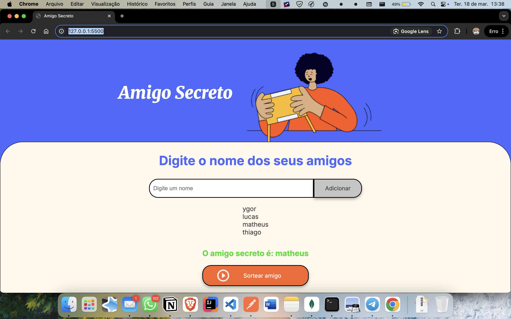

# 🎁 Amigo Secreto

Este é um projeto simples de **Amigo Secreto**, desenvolvido com **HTML, CSS e JavaScript**. Ele permite que os usuários adicionem nomes de amigos e realizem um sorteio aleatório para escolher um participante.

## 🚀 Funcionalidades

- 📌 **Adicionar nomes** à lista de participantes.
- 📜 **Exibir a lista** de amigos adicionados.
- 🎲 **Sortear um amigo secreto** de forma aleatória.
- 🖌️ **Interface amigável e interativa**.

## 📷 Captura de Tela



## 📂 Como Usar

1. **Clone ou baixe** o repositório:
   ```sh
   git clone https://github.com/Ynacif31/amigo-secreto.git
   ```
2. **Abra o arquivo `index.html`** no navegador.
3. **Digite o nome dos participantes** e clique em "Adicionar".
4. **Clique em "Sortear Amigo"** para selecionar um nome aleatoriamente.

## 🔧 Tecnologias Utilizadas

- **HTML5**
- **CSS3**
- **JavaScript (Vanilla JS)**

## 🌍 Publicação no GitHub Pages

Este projeto está disponível online através do GitHub Pages:
🔗 [Acesse aqui]( https://ynacif31.github.io/desafio-oracle-amigo-secreto/)

## 🤝 Contribuindo

Se quiser contribuir com melhorias, siga os passos:
1. **Faça um fork** do repositório.
2. **Crie uma branch** com a nova funcionalidade:
   ```sh
   git checkout -b minha-feature
   ```
3. **Commit suas alterações**:
   ```sh
   git commit -m "Adicionando nova funcionalidade"
   ```
4. **Envie para o repositório**:
   ```sh
   git push origin minha-feature
   ```
5. **Abra um Pull Request** 🚀

## 📜 Licença

Este projeto está sob a licença **MIT**. Sinta-se à vontade para usá-lo e modificá-lo! 😊

---

Feito com ❤️ por [Ygor Nacif](https://github.com/Ynacif31)
